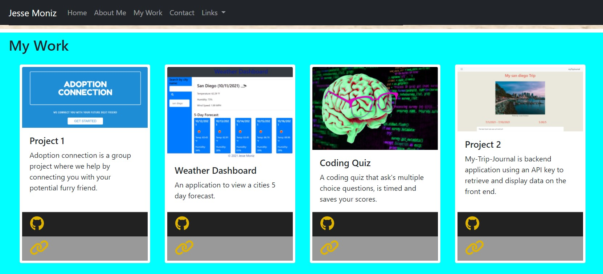

# portfolio2.0

## Description
This is my portfolio2.0 where I show my front end skills to display my latest and greatest work.

## Credits

I would like to give credit to my Varsity Tutor for taking the time to teach me more about bootstrap.

## Table of Contents

[Description](#description)

[Study-Material](#Study-Material)

[Features](#features)

[Links](#links)

[Repository](https://github.com/jmoniz155/portfolio2.0)

## Study-Material

[Bootstrap](https://getbootstrap.com/)

[Font Awesome](https://fontawesome.com/)

[Font Awesome Icons](https://fontawesome.com/v5.15/icons?d=gallery&p=2&s=brands)

[Bootstrap Navbar](https://getbootstrap.com/docs/5.0/components/navbar/)

## Features

This portfolio was built using HTML 3, CSS 5, and Javascript.

## Links

[Repository](https://github.com/jmoniz155/portfolio2.0)

[Live Link](https://jmoniz155.github.io/portfolio2.0/)
